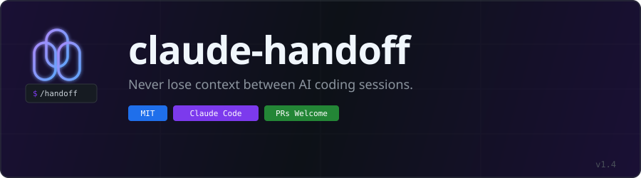

<p align="center">
  
</p>

**Never lose context between AI coding sessions.**

Session handoff skills for [Claude Code](https://claude.ai/code) that capture decisions, failed approaches, measurements, and next steps — so your next session picks up exactly where you left off. Save context, use fewer tokens, and stop wasting 20-40% of each session rediscovering what was already tried.

[](https://github.com/REMvisual/claude-handoff/releases/latest)


## Install

```bash
git clone https://github.com/REMvisual/claude-handoff.git
cp -r claude-handoff/skills/handoff ~/.claude/skills/
cp -r claude-handoff/skills/handoffplan ~/.claude/skills/
```

Verify: open Claude Code and type `/handoff` — it should appear in autocomplete.

## Usage

```
/handoff              # Capture session context into a structured file
/handoffplan          # Capture context + generate an implementation plan
```

No arguments needed. The skill mines your full conversation, gathers git state, validates the output, and gives you a ready-to-paste resume prompt:

```
Read `plans/handoffs/HANDOFF_fix-auth-bug_2026-03-19.md` (seq 2, PROJ-abc1)
and continue from "Where We're Going".
```

Paste that into a fresh Claude Code session. It picks up the chain and starts working.

## What you get

Every handoff captures a structured snapshot of your session:

```
┌─────────────────────────────────────────────────────┐
│  HANDOFF_fix-auth-bug_2026-03-19.md                 │
├─────────────────────────────────────────────────────┤
│  The Goal           — what we're solving and why    │
│  Where We Are       — 15-25 bullets of current state│
│  What We Tried      — every approach, chronological │
│  Key Decisions      — what was chosen AND rejected  │
│  Evidence & Data    — real numbers, not summaries   │
│  Where We're Going  — ordered next steps            │
│  Quick Start        — exact commands for next session│
└─────────────────────────────────────────────────────┘
```

**"What We Tried" is the most valuable section.** Failed approaches are the single most expensive thing to rediscover across sessions. This section captures every attempt — what was tried, what happened, and why it was kept or abandoned — so the next session never repeats work.

See [`examples/`](examples/) for full sample handoff and plan files.

## Why this exists (not just "what")

Claude already tries to hand off context between sessions. When a session ends or context compresses, it generates a summary with sections like "What's broken" and "Next session paste-prompt." It looks like a handoff. It isn't one.

We ran a controlled test: same P0 bug, same codebase, two fresh sessions launched simultaneously. One got Claude's auto-generated session summary. The other got a `/handoff` skill output. Both sessions had identical access to the code.

| Dimension | Session summary (no skill) | `/handoff` skill output |
|---|---|---|
| **User had to intervene** | Yes — "don't alter anything yet" | No — self-gated, waited for go-ahead |
| **Comprehension proof** | None — dove straight into code | Full narration of goal, state, prior attempts |
| **Fix quality** | Cookie band-aid (patches symptom) | Server-side token store (fixes root cause) |
| **Chain awareness** | Zero | Referenced prior session's analysis by name |
| **Bug discovery** | Found 6 bugs (aggressive exploration) | Found 4 bugs (trusted handoff's file list) |
| **Bead/task tracking** | Read bead but never claimed it | Explicitly claimed and linked |

The skill session proposed a better architectural fix because it was forced to understand the problem first. The summary session read more code but understood less.

Full comparison data: [`docs/COMPARISON_skill-vs-internal-handoff.md`](docs/COMPARISON_skill-vs-internal-handoff.md)

### The skill shadowing problem

Without explicit guardrails, Claude generates freeform "handoffs" that borrow the skill's vocabulary but lack its process — no chain tracking, no self-validation, no comprehension gates, no evidence mining. Users can't tell the difference without comparing side-by-side. See [Recommended setup](#recommended-prevent-skill-shadowing) below.

## How it works

### `/handoff` — Context capture

The core skill. When you run `/handoff`, it:

1. **Detects context tier** — automatically selects mining strategy based on conversation size. At 500K+ tokens (common on 1M context models), LLMs exhibit a "lost in the middle" problem where 30%+ of information in the middle of context gets missed. The skill compensates with multi-pass map-reduce extraction
2. **Mines your conversation** using a 12-item checklist — goals, work completed, approaches tried, failed approaches, test results, decisions made, discoveries, code analysis, user preferences, remaining questions, and dependencies
3. **Gathers external state** — git log, diff, uncommitted changes, active tasks from your tracker (in parallel using agent teams)
4. **Detects chain continuity** — finds prior handoffs in the same work stream via task IDs, inherits the chain tag and sequence number
5. **Checks for stale references** — verifies that code identifiers from prior handoffs still exist in the codebase
6. **Writes a validated file** — enforces line minimums and data completeness. Tier 3 (massive sessions) enforces a 450-line floor. If the first pass is too thin, it goes back and mines deeper
7. **Generates a resume prompt** — a paste-ready one-liner for the next session

Output: `HANDOFF_{slug}_{date}.md` in `plans/handoffs/` or `.claude/handoffs/`

### `/handoffplan` — Context capture + action plan

Runs the full `/handoff` first, then writes a paired implementation plan:

- **Phased steps** grounded in session evidence — every phase traces to findings from the handoff
- **Anti-goals** — what NOT to do, pulled from failed approaches and rejected alternatives
- **Rollback strategy** per phase — what to revert if things get worse
- **Success criteria** with baseline numbers from the handoff data

Output: `PLAN_{slug}_{date}.md` paired with the handoff file

### PreCompact hook — Safety net

A lightweight shell script that runs before context compaction, capturing ~50 lines of active tasks, recent commits, and uncommitted changes. Not a replacement for `/handoff` — a fallback so you never lose orientation completely.

### Chain tracking

Handoffs link across sessions via task or issue IDs:

```
HANDOFF_fix-auth_2026-03-17.md  (seq 1)
    └→ HANDOFF_fix-auth_2026-03-18.md  (seq 2, parent: seq 1)
        └→ HANDOFF_fix-auth_2026-03-19.md  (seq 3, parent: seq 2)
```

Your third session on a feature knows about the first two. The resume prompt carries the chain tag and sequence number, so detection is automatic.

### Context-aware mining (new in v1.3)

At 500K+ tokens, a single extraction pass demonstrably misses decisions and measurements from the middle of conversation ([research](https://aclanthology.org/2024.tacl-1.9/)). The skill automatically selects a mining strategy:

| Tier | Context size | Strategy |
|---|---|---|
| 1 | Under 100K | Single checklist pass |
| 2 | 100K–500K | Two passes: structured extraction + gap-fill for middle content |
| 3 | 500K+ | Map-reduce: chunk conversation, extract per-chunk, merge + validate |

The tier is announced at the start of mining ("Mining at Tier 3 — 1M context, 100+ tool calls"). Tier 3 enforces a 450-line floor — massive sessions cannot be adequately captured in fewer lines.

### Self-validation

Every handoff runs through quality checks before it's written:

**Standard (200K context):**

| Session type | Minimum lines | Target range |
|---|---|---|
| Light (quick fix) | 80 | 80–120 |
| Medium (multi-step) | 120 | 120–180 |
| Heavy (testing, data, pivots) | 150 | 180–300 |

**Extended (1M context):**

| Session type | Minimum lines | Target range |
|---|---|---|
| Light (quick fix) | 120 | 120–200 |
| Medium (multi-step) | 200 | 200–350 |
| Heavy (testing, data, pivots) | 250 | 300–600 |

The skill auto-detects your context window size from the system prompt. If the draft is under the minimum, it re-mines the conversation and expands thin sections. Sessions over the split threshold (300 standard / 600 extended) split into cross-referenced parts.

## Works great with

Everything is optional — the skills work standalone and degrade gracefully. But they unlock more when paired with complementary tools:

### Recommended stack

| Tool | What it does for handoffs | Link |
|---|---|---|
| **[Beads](https://github.com/beads-project/beads)** | Issue tracking that lives in your repo. Handoffs auto-detect active beads, use bead IDs as chain tags, and update bead notes on close. The tightest integration. | [Install beads](https://github.com/beads-project/beads#install) |
| **[OpenViking](https://github.com/openviking/openviking)** | Persistent AI memory across sessions. Handoffs search OV for prior decisions, failed approaches, and context from earlier sessions — so chain continuity extends beyond what's in the handoff files. | [Install OpenViking](https://github.com/openviking/openviking#install) |
| **Git** | `git log`, `git diff`, `git status` for state gathering. Runs automatically when git is available. | — |

### How the stack fits together

```
Beads       → tracks WHAT work needs doing (issues, deps, priorities)
OpenViking  → remembers WHAT was learned (decisions, patterns, gotchas)
Handoff     → captures WHERE you stopped (state, evidence, next steps)
```

Beads gives handoffs their chain tags. OpenViking gives handoffs prior context. Together, a new session can reconstruct the full picture: what's assigned, what was tried before, and exactly where to pick up.

### Other integrations

- **Any CLI task tracker** — Linear, Jira CLI, GitHub Issues. The skill files use `bd` (beads) as a concrete example — swap in your tracker's CLI.
- **Any memory/recall system** — the skills search for prior context automatically when a recall tool is available.

## Recommended: Prevent skill shadowing

Without this, Claude may generate freeform "handoffs" when sessions end — documents that look like skill output but lack chain tracking, validation, and comprehension gates. Add this to your global `~/.claude/CLAUDE.md` or project-level `CLAUDE.md`:

```markdown
## Handoffs

When ending a session, saving progress, or providing context for a future session:
- ALWAYS use the `/handoff` skill. NEVER generate handoff summaries, session status
  documents, or "paste prompts for next session" without the skill.
- The precompact hook handles automatic context compression — don't duplicate it manually.
```

The skill itself includes an anti-shadowing guard (v1.5.0+), but the `CLAUDE.md` instruction catches the case where Claude decides to "help" without invoking any skill at all.

## Customization

Edit the skill files directly in `~/.claude/skills/handoff/skill.md`:

- **Line budgets** — adjust minimums and target ranges per session type
- **Output directory** — default priority: `plans/handoffs/` > `.claude/handoffs/`
- **Chain tag resolution** — adapt the logic to match your project's task ID scheme
- **Handoff template** — add or remove sections to fit your workflow

## PreCompact hook setup

```bash
cp claude-handoff/hooks/precompact-handoff.sh ~/.claude/hooks/
chmod +x ~/.claude/hooks/precompact-handoff.sh
```

Register as a `PreCompact` hook in your Claude Code settings. The script has no dependencies — it uses `git` and optionally your task tracker, skipping gracefully when unavailable.

## Uninstall

```bash
rm -rf ~/.claude/skills/handoff ~/.claude/skills/handoffplan
rm -f ~/.claude/hooks/precompact-handoff.sh
```

Handoff files in your projects are yours to keep or delete.

## Contributing

See [CONTRIBUTING.md](CONTRIBUTING.md).

## License

[MIT](LICENSE)

If this tool saved you time, [give it a star](https://github.com/REMvisual/claude-workspace-snapshot). It helps others find it.

[](LICENSE)
[](https://claude.ai/code)
[](CONTRIBUTING.md)
